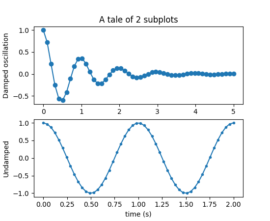
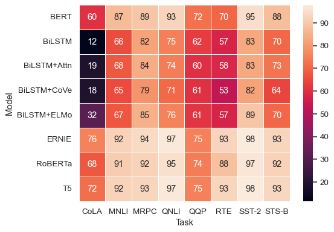
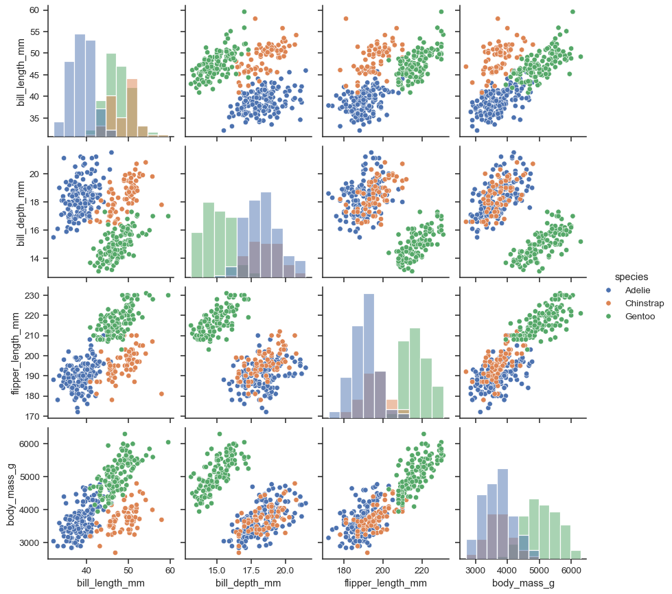

# Matplotlib and Seaborn Visualization Guide

This repository contains a comprehensive Jupyter Notebook that serves as a tutorial and reference for using **Matplotlib** and **Seaborn** to create powerful and insightful visualizations. Below is an outline of the topics covered, as well as how to navigate the notebook.

---

## Overview

### Libraries Used:
- **Matplotlib**: A versatile library for creating static, animated, and interactive visualizations in Python.
- **Seaborn**: A high-level data visualization library built on Matplotlib, designed for statistical graphics.

### Key Concepts Covered:
1. **Introduction to Matplotlib and Seaborn**:
   - Importance of data visualization.
   - Differences between Matplotlib and Seaborn.
   - Integration with Pandas.

2. **Basic Plotting**:
   - Line plots, scatter plots, bar plots, and histograms.
   - Customizations: titles, axis labels, limits, and ticks.
   - Additional exploratory plots: boxplots and error bars.

3. **Subplots and Layouts**:
   - Creating multiple plots in a single figure.
   - Using `plt.subplot()`, `plt.subplots()`, and `plt.tight_layout()`.
   - Advanced layouts with `GridSpec`.

4. **Customization and Annotations**:
   - Adding legends, text annotations, and custom styles.
   - Styling plots with line styles, markers, and colors.
   - Using `plt.annotate()` for advanced annotations with arrows.

5. **Saving Figures**:
   - Saving plots in different formats (e.g., PNG, PDF) using `plt.savefig()`.
   - Specifying DPI for high-quality exports.

6. **Introduction to Seaborn**:
   - Differences between Seaborn and Matplotlib.
   - Creating statistical visualizations with Seaborn.

7. **Statistical Plots**:
   - Pair plots, correlation heatmaps, violin plots, box plots, joint plots, and distribution plots.
   - Customizing Seaborn plots (color palettes, themes).
   - Using `FacetGrid` for conditional subplots based on data features.

8. **Seaborn’s Time Series and Regression Plots**:
   - Visualizing time-based data trends with line plots.
   - Regression plots to show relationships and fits between variables.

---

## How to Use

### Prerequisites:
Ensure you have the following Python libraries installed:
- `matplotlib`
- `seaborn`
- `pandas`
- `numpy`

To install these libraries, use the following command:
```bash
pip install matplotlib seaborn pandas numpy
```

### Running the Notebook:
1. Clone this repository to your local machine:
   ```bash
   git clone git@github.com:hfakour/Matplotlib_Tutorial.git
   ```
2. Open the Jupyter Notebook in your environment:
   ```bash
   jupyter notebook
   ```
3. Navigate to the notebook file and run the cells sequentially.

### Exploring the Notebook:
Each section is self-contained and includes clear explanations, sample code, and visual outputs. Code comments are provided to help users understand the logic behind each step.

---

## Example Visualizations

### Matplotlib Examples:
- **Line Plot**:
  

- **Subplots with Tight Layout**:
  

### Seaborn Examples:
- **Correlation Heatmap**:
  

- **Pair Plot**:
  

---

## Contributions

Contributions to this repository are welcome! If you have additional examples or improvements to suggest, please feel free to create a pull request or open an issue.

---

## License
This project is licensed under the MIT License. See the LICENSE file for details.

---

## Contact
For questions or feedback, feel free to reach out via the repository’s Issues page.

